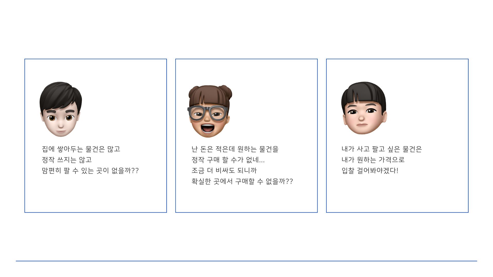
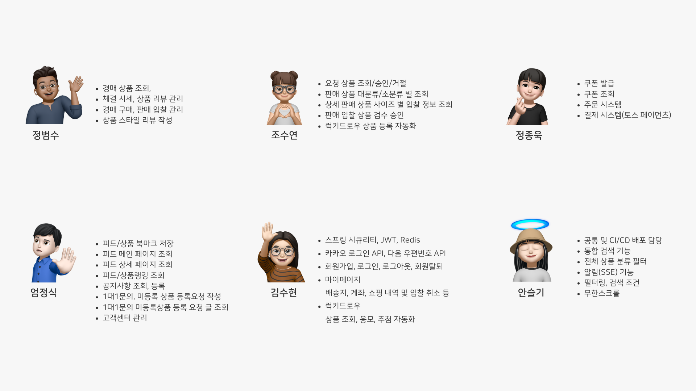
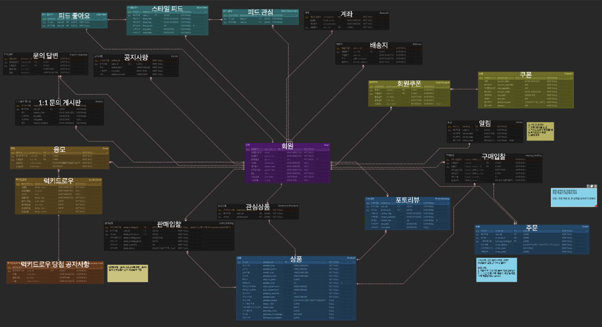

# PUSH
feat.슈우우우웅👋

## 1. 프로젝트 소개
### 1) 개발기간
2024.06.09 ~ 2024.07.30 (약 9주)

### 2) 📚기술스택
| Front-End |                                                                                                                                                                                                                                                                                                                                             |
|:---------:|:---------------------------------------------------------------------------------------------------------------------------------------------------------------------------------------------------------------------------------------------------------------------------------------------------------------------------------------------------------------------------------------------------------------------------------------------------------------------------------------------------------------------------------------------------------------------------------------------------------------------------------------------------------------------------------------------------------------------------------------------------------------------------------------------------------------------------------------------------------------------------------------------------------------------------------:|
| Back-End  |           |
|    DB     |                                                                                                                                                                                                                                                                                                                                                                                                                                                                                                                                                                                                                                                                                                                                         |
|  DevOps   |                                                                                                                                                                                                                                                                                                                                     |
|    API    |                                                                                                                                                                                                                                                                                                                                                                                                                                                                                                                                                                                                                                                                                                                          |
|   Tool    |                                                                                                                                                                                                                                    |
### 3) 😆팀원소개
| 이름  | 역할             | 담당 기능                                                                                                                                                |
|-----|----------------|------------------------------------------------------------------------------------------------------------------------------------------------------|
| 안슬기 | BE, FE, DEPLOY | 1. 알림 기능 2. 메뉴 필터링, 검색 조건 3. 젠킨스를 이용한 배포                                                                                                     |
| 김수현 | BE, FE         | 1. MySQL DB 모델링 및 문서화 2. SpringSecurity, JWT, Redis 사용자 인증/인가 관리 3. 회원 기능 4. 마이페이지 5. 럭키드로우                                      |
| 엄정식 | BE, FE         | 1. 스타일 피드 관리 2. 관시상품, 관심스타일 관리 3. 고객센터 관리 4. Object Storage를 통한 이미지 원격 저장                                                                |
| 정범수 | BE, FE         | 1. 경매 상품 조회 및 입찰기능 구현 2. MySQL DB 설계 및 문서화 3. JPA, QueryDsl을 통한 상품, 리뷰 CRUD 작업 4. 상품 페이지 프론트 구현 5. Axios를 사용한 RESTful API 호출과 데이터 처리 |
| 정종욱 | BE, FE, DESIGN | 1. 쿠폰 조회 및 쿠폰 발급 기능 2. 주문 기능 및 토스페이먼츠를 사용한 테스트 결제                                                                                               |
| 조수연 | BE, FE         | 1. 관리자 페이지 상품 관리 2. 상품 카테리별 조회 3. 스케줄을 이용한 상품 등록                                                                                             |

## 2. 기획
### 1) 기획의도

 
### 2) 전체 아키텍쳐

### 3) ERD
ERD보러가기 https://www.erdcloud.com/d/HvEwBYsCicz2AuAcW

## 3. 기능
### 1) 회원
- 회원가입
- 자사 회원가입
- 로그인
  - 자사 회원가입
  - 카카오로그인 API
  - Axios 인터셉터를 사용해 API 요청/에러 공통 관리
- 로그아웃
    - Redis JWT 블랙리스트 등록
- 회원탈퇴
#### 1.1) 마이페이지
  - 구매/판매 내역
    - 전체/검수중/입찰중/종료 상태별 거래 내역 조회
    - 입찰 중 상품 입찰 취소
  - 응모 내역
    - 럭키드로우 응모 내역 및 당첨 결과 조회
  - 관심 스타일/상품
    - 북마크 저장한 관심 스타일/상품 조회
  - 프로필 관리
    - 프로필 이미지, 닉네임, 휴대폰번호, 비밀번호 수정
  - 배송지 관리
    - 다음 우편번호 API를 사용한 배송지 추가/수정/삭제
  - 계좌 관리
    - 판매 정산 계좌 등록 및 수정
  - 쿠폰 내역
    - 발급 쿠폰 조회

#### 1.2) 알림
  - 럭키드로우 응모
  - 럭키드로우 당첨
  - 쿠폰 발급
  - 1:1 문의 답변 등록

### 2) 상품
- 메인
    - 각각 인기, 최신등록, 최신 구매입찰/판매입찰 5개 상품씩 조회
- 의류, 라이프, 테크별 대분류 조회
  - 소분류 조회
  - 의류: 상의, 하의, 아우터, 이너웨어, 신발
  - 라이프: 키친, 뷰티, 인테리어
  - 테크
#### 2.1) 상품 조회
- 각 카테고리내의 상품 별 기본정보 및 가격조회
- 상품 리뷰 작성
- 각 기간 별 평균 시세 조회
- 최근 체결 금액 간 변동가 확인
#### 2.2) 입찰
- 선택 상품 사이즈 입찰 작성 및 전송
- 즉시 주문 시 해당 정보 작성 및 전송

#### 2.3) 주문/결제
- 구매/판매 입찰 등록
  - 사용자가 입력한 데이터로 상품의 입찰 등록
- 구매/판매 주문 생성
  - 정산 계좌 변경 , 배송지 변경, 배송 요청사항, 쿠폰 적용
  - 주문 페이지/기능 구현
- 결제
  - 토스 페이먼츠를 연동해 테스트 결제 구현
### 3) STYLE
- 전체 조회
- 상세 조회
- 피드 등록
- 피드 좋아요
- 관심피드 저장

### 4) SHOP
- 전체 상품 조회
- 상품 카테고리별 필터링
- 검색 기능
### 5) 랭킹
- 상품랭킹
  - 의류, 라이프, 테크 3개의 항목으로 상품 랭킹 조회(좋아요 순)
- 피드랭킹 (해당 피드의 좋아요 순)
### 6) 럭키드로우
- 응모 상세 조회
    - 매주 월요일 11시 응모 마감 자동화
    - 매주 화요일 18시 당첨자 추첨 자동화
    - 응모마감일까지 잔여시간 실시간 업데이트
- 응모
  - 진행 중 럭키드로우 응모 내역 등록
  - 중복 응모 불가능
### 7) 쿠폰
- 이벤트 쿠폰 발급
### 8) 고객센터
- 공지사항
  - 전체 조회
  - 상세 조회
- 1:1 문의
  - 등록
  - 조회
- 미등록 상품 등록 요청
  - 등록 요청 작성
  - 등록 요청 전체 조회
  - 등록 요청 상세 조회
### 9) 관리자
- 요청 상품 관리
    - 요청 상품 조회
    - 요청 상품 상세정보 수정 / 승인
- 상품 관리
    - 대분류 / 소분류 별 상품 조회
    - 상품 상세 관리
        - 사이즈별 상품 조회
        - 검수중 상품 승인
- 럭키드로우 상품 관리
    - 럭키드로우 상품 상태별 조회(READY,PROCESS,END)
    - 럭키드로우 상품 등록
- 공지사항 관리
  - 공지사항 등록
  - 공지사항 등록 전체 조회
  - 공지사항 등록 상세 조회
  - 공지사항 등록 수정 및 삭제
- 1:1 문의 관리
  - 1:1 문의 답변 등록
  - 1:1 문의 전체 조회
  - 1:1 문의 상세 조회