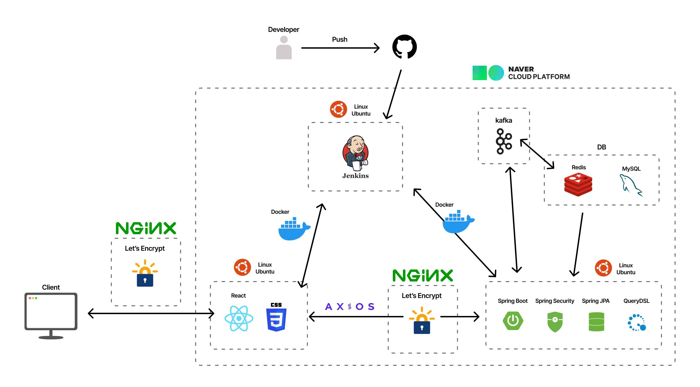

# PUSH
feat.슈우우우웅👋

## 1. 프로젝트 소개
### 1) 개발기간
2024.06.09 ~ 2024.07.30 (약 9주)

 

### 2) 📚기술스택
| FRONT |
  
  
  
  
   |
|--------|------|
| 안슬기 |      |
| 정종욱 |      |
| 정범수 |      |
| 김수현 |      |
| 엄정식 |      |
| 조수연 |      |
  

### 3) 팀원소개
 
| 이름   | 역할 |
|--------|------|
| 안슬기 |      |
| 정종욱 |      |
| 정범수 |      |
| 김수현 |      |
| 엄정식 |      |
| 조수연 |      |
| <b>이름</b> | <b>역할</b> |<b>BE</b>|<b>FE</b>
|:—:|:—:|:—:|:—:
|안슬기|팀장|- ㅇ   - ㅇ|- ㅇ   - ㅇ
|김수현|팀원|- ㅇ   - ㅇ|- ㅇ   - ㅇ
|엄정식|팀원|- ㅇ   - ㅇ|- ㅇ   - ㅇ
|정범수|팀원|- ㅇ   - ㅇ|- ㅇ   - ㅇ
|정종욱|팀원|- ㅇ   - ㅇ|- ㅇ   - ㅇ
|조수연|팀원|- ㅇ   - ㅇ|- ㅇ   - ㅇ
 

## 2. 기획
### 1) 기획의도

 
### 2) 전체 아키텍쳐

 

## 3. 기능

